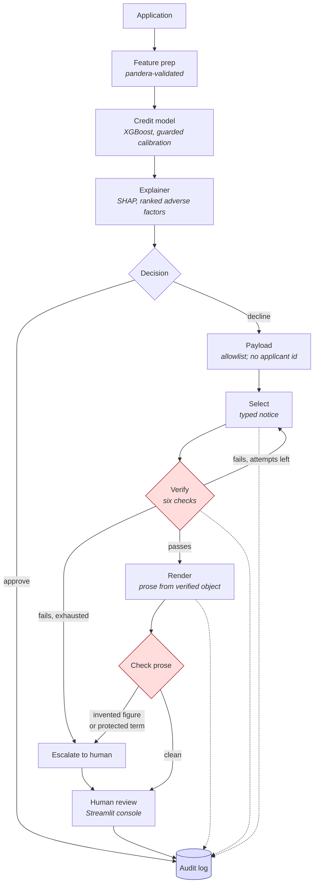

# Adverse Action Engine

Verifiable adverse action notices for credit decisions.

When a lender declines a credit application, regulation requires it to state the actual
reasons. Generating those notices with a language model is attractive and dangerous: a
fabricated reason in a denial notice is a compliance failure, not a cosmetic bug.

This system generates the notice **and mechanically proves every claim in it is true**
before a human reviewer ever sees it.

## The design decision

Do not verify prose. Verify a typed object, then render prose from it.

Generation runs in two stages:

1. **Select** — the model emits a structured `AdverseActionNotice`: which factors were
   principal reasons, what factual claims are made, which regulatory provisions are cited.
2. **Render** — the model writes customer-facing prose constrained to that verified object,
   and the verifier re-checks the prose introduces no claim absent from it.

Because stage-one output is typed, every field is checkable against ground truth the system
already holds — the real feature values, the real SHAP attributions, and the real regulation
corpus. Verification is deterministic. There is no model grading another model, which is why
the resulting groundedness figure means something.

## Architecture



Dotted lines are audit writes. Every stage is recorded, and the decision and
its notice are written in a single transaction — a decision without its notice
is a partial chain, which looks like evidence and is not.

## Documents

| Document | What it answers |
|---|---|
| [MODEL_CARD.md](MODEL_CARD.md) | What this model is, what it may be used for, how it behaves |
| [VALIDATION_REPORT.md](VALIDATION_REPORT.md) | What was checked, what was found, **and what was not** |
| [DESIGN.md](DESIGN.md) | What was chosen, what was rejected, and why |
| [reports/fairness.json](reports/fairness.json) | Disparate impact, regenerated from a run |
| [reports/drift.json](reports/drift.json) | Population stability, regenerated from a run |

The model card and validation report are **generated** by
`python -m aae.ml.model_card`, not written by hand. One someone typed is a
description of what they believed; one the pipeline emits is a measurement.

## The verifier

Six independent checks, in `src/aae/verification/`:

| Check | What it catches |
|---|---|
| Factor grounding | Reasons citing a factor that is not in the SHAP top-K, or whose direction is inverted |
| Value accuracy | Any stated figure that disagrees with the real feature value |
| Citation validity | Fabricated regulation — the quoted span must appear verbatim in the cited chunk |
| Element coverage | Legally required elements missing from the notice |
| Prohibited content | Any reference to a protected attribute. Must be zero |
| Reason count | More principal reasons than the jurisdiction permits |

Failures feed back into a repair prompt for up to three attempts, then escalate to a human.
The escalation rate is a reported metric, not a hidden fallback.

## Fair lending

`CODE_GENDER` and age are present in the dataset. They are used **exclusively as protected
attributes for fairness measurement and are never model features** — using them as inputs
would be unlawful in real lending. A unit test enforces their absence from the trained
feature set.

## Quickstart

```bash
python -m uv venv
python -m uv pip install --python .venv/bin/python -e ".[dev]"
cp .env.example .env
docker compose --profile core up -d
.venv/bin/alembic upgrade head
.venv/bin/python -m pytest
```

On Windows the venv scripts live in `.venv/Scripts/` rather than `.venv/bin/`.

Postgres is published on host port **5433**, not 5432. A locally installed
PostgreSQL service commonly already owns 5432 and would silently win for
`localhost` connections, producing authentication failures that look like a
credential problem rather than a port collision.

Compose profiles keep the footprint small enough for a 12 GB machine — bring up
only what you are working on:

```bash
docker compose --profile core up -d      # Postgres only
docker compose --profile api up -d       # + the API
docker compose --profile console up -d   # + the Streamlit console
```

### Verifying the audit guarantee

The append-only property is enforced by Postgres, so it can be checked directly:

```bash
.venv/bin/python -m pytest tests/integration -m integration
```

Those tests assert that the application role may `INSERT` and `SELECT`, that the
database rejects `UPDATE`, `DELETE`, and `TRUNCATE`, and that the hash chain
detects tampering even by a privileged role that can bypass the grants.

## Data

The real Home Credit extract is used when `data/application_train.csv` is
present. Otherwise a synthetic generator produces a frame with the same
columns, dtypes, missingness, and statistical structure, so tests, CI, and a
fresh clone all work without a Kaggle account. Provenance travels with the
data and is recorded on the model, because "trained on synthetic data" is a
material fact about a credit model.

## Model

XGBoost with native categorical support, so SHAP attributions name real
category levels rather than one-hot indices — a denial reason has to be
readable by the person receiving it.

Calibration is **guarded**: isotonic regression is fitted on part of the
calibration split, judged on the rest, and kept only if it measurably improves
expected calibration error. Otherwise the model ships with an identity mapping.
Fitting isotonic unconditionally degrades calibration as often as it helps —
measured here, it hurt at 2,400 calibration rows and helped at 4,800. The
guarantee is that calibration never makes a quoted probability worse.

`scale_pos_weight` is deliberately unused. It lifts ranking metrics on an 8%
positive rate and destroys calibration by construction, and a denial rests on a
probability threshold, not a ranking.

## Explaining a decision

SHAP attributes each decision to its individual features, ranked by how far
they moved the score. Those factors are the ground truth the verifier will
check generated reasons against: if a notice names a factor, it must appear
here with a matching direction.

One subtlety, because a reviewer will ask. SHAP explains the booster's raw
log-odds, not the calibrated probability the threshold is applied to. That is
sound because calibration is *monotone*: it can move where the threshold sits
but cannot reorder two applicants or flip the sign of a contribution, so the
ranking and direction of factors survive it exactly. A test asserts this rather
than assuming it.

## API

```
GET  /health                            model version, threshold, chain state
POST /v1/decisions                      score, explain, and record
GET  /v1/decisions/{id}/audit           reconstruct a decision from the chain
GET  /v1/audit/verify                   recompute every hash in the chain
```

A decision and its audit record are inseparable. If the audit write fails the
request fails, because returning a decision that was not recorded is exactly
the unauditable outcome this system exists to prevent.

The API will not accept sex, age, or marital status at all. They cannot
lawfully influence the outcome, so there is no reason to collect them in order
to score one application.

Appends are serialised with a Postgres transaction-level advisory lock.
Extending a hash chain means reading the tail, so concurrent writers would
otherwise fork it, and a forked chain is not evidence of anything. A test runs
twenty threads at once and verifies the result is a single unbroken chain.

## What the verifier does and does not claim

It claims that every assertion in a notice agrees with evidence the system
already holds: the feature values that were scored, the SHAP attributions that
explain the score, the corpus text a citation quotes, and the regulator's
requirements. That evidence exists independently of the generator, so the check
is deterministic and repeatable and its result means something.

It does not claim the notice is well written or persuasive. Those are real
qualities and are not verifiable this way. A language model scoring them is
scoring taste, and reporting that as a groundedness figure would be worse than
not measuring it.

Failures are separated into two kinds. A **violation** is a way the notice is
wrong that regeneration could fix, and is fed back into the repair prompt. A
**precondition failure** — wrong applicant, wrong jurisdiction, an application
that was approved — raises instead, because rewriting cannot fix a bug and
retrying would only burn attempts.

Notices in the test suite are hand-written, including deliberately fabricated
ones. A verifier tested only against real model output is tested only against
the mistakes that model happens to make, and the ones that matter are the
mistakes it makes rarely. Property tests then assert the stronger claim: no
notice citing a factor absent from the decision can pass, whatever it says.

## Jurisdictions

Requirements are pluggable. `india_rbi` encodes the RBI Fair Practices Code
obligation to convey reasons for rejection in writing, plus the disclosed
grievance redressal route. US Regulation B follows the same interface.

Required elements carry a predicate wherever the structured notice can be
checked directly, rather than trusting the model's own declaration that it
complied. A model asserting "yes, I included the reasons" is not evidence that
it did — there is a test that declares every element while supplying none.

## Generation

Two stages, for one reason.

**Select** returns a typed object — which factors are the principal reasons,
what is claimed, which provisions are cited — every field of which is checkable
against evidence the system already holds. **Render** turns the *verified*
selection into prose and is shown nothing it could get wrong about the record:
not the identifier, not the feature values, only the sentences that already
passed. Prose is where a model invents; the less it is given, the less there is
to invent about.

The model never sees the applicant identifier. It returns reasons and
citations; identity is attached afterwards from the decision. A model that
never sees an id cannot attribute a notice to the wrong person, so that failure
becomes structurally impossible to cause by generation rather than merely
detectable.

Rejected attempts are repaired by feeding the verifier's own violation text
back, unaltered — paraphrasing them loses the locator saying which reason was
wrong. Repair is bounded at three attempts, and exhausting it escalates to a
human with the violations attached. **A provider failure is not an
escalation**: an unreachable backend is an operational problem, and folding it
into the escalation rate would make a network outage look like the model
getting worse.

## What reaches a language model

An allowlist, not a redactor. A redactor inspects a payload and removes what it
recognises, so anything it fails to recognise is disclosed. Here the payload is
*built* from a fixed set of permitted fields, so a value can only reach a
provider by being named.

Protected attributes are excluded twice over. Favourable factors are withheld
too — a model given them will eventually offer one as a reason for declining,
and not presenting the temptation is cheaper than repairing it.

Presidio is deliberately absent: it detects PII in free text, and this payload
has none. It becomes necessary the moment an applicant-supplied string enters
the payload.

## Providers

Cerebras, Groq, and a local Ollama all speak the OpenAI chat-completions
protocol, so there is one adapter parameterised by URL, model, and credential
rather than three SDKs.

That abstraction stopped being hypothetical during this project. Cerebras was
the primary backend; it withdrew its free tier and now answers `402` for every
model, and the model this project had pinned no longer appears in its catalogue
at all. Migrating to Groq was two environment variables — nothing in the graph,
the verifier, the audit chain, or the harness knows which backend answered.

Structured output is **constrained** to the expected schema at the decoder, not
requested in prose. Asking for `json_object` buys syntactically valid JSON and
nothing else: against a live backend the model returned a well-formed object
with invented field names, which is a normal thing for a model to do and not
something reprompting fixes reliably. The schema now travels with the request.
Validation still runs on arrival, because a constraint the backend ignores must
fail as a provider error rather than flow onward as a half-populated notice.

Model names are pinned against a live listing rather than from memory. A
renamed model returns `404` and a withdrawn free tier returns `402`; from the
outside both look like the LLM call failed, and neither is a bad credential.

## Retrieval

The corpus serves two different jobs. **Lookup** resolves a citation to the
exact text it claims to quote, which is what makes a fabricated regulation
detectable. **Search** finds which provisions apply. Vectors are stored with
the name of the embedder that produced them, and a mismatch is refused rather
than answered: vectors from different models are not comparable, and searching
across them returns confident nonsense.

Tests use a deterministic hashing embedder rather than downloading a model. A
build that fails because a model host was slow has told you nothing about the
code.

## Measured results

100 declined applications, run end to end. Against a simulated provider with a
deliberately pessimistic failure distribution:

| Metric | Result |
|---|---|
| Groundedness rate (first attempt, unaided) | 54.0% |
| Post-repair rate (issued) | 97.0% |
| Escalation rate | 3.0% |
| Factor fidelity | 88.3% |
| Citation precision | 82.0% |
| Element coverage | 99.8% |
| **Prohibited content in issued notices** | **0.0000** |
| Prohibited proposals caught | 2 |
| Mean attempts | 1.48 |
| Readability (Flesch) | 63.0 |

The shape of that is the point. The model gets it right unaided barely half the
time. The verifier catches the rest — 100 violations across six checks — and
the repair loop turns most of them into issuable notices. Three per cent could
not be made truthful and went to a human. **Nothing ungrounded reached an
applicant**, and the prohibited-content check fired twice, so that zero is a
measurement rather than an absence of testing.

**What this measures, and what it does not.** These figures describe how the
*system* handles a fixed distribution of model mistakes. They are not a claim
about any real model's quality. Reporting one as the other would be exactly the
dishonesty this project argues against.

Live figures are a manual step, because a gate that needs a credential and
obeys a rate limit cannot run in CI. The throttle is not incidental: Groq's
free tier allows 8,000 tokens per minute, a case costs roughly 3,500, and an
unthrottled run is abandoned rather than slow.

```bash
python -m evals.runner --provider simulated                # the CI gate
python -m evals.runner --provider groq --throttle 35       # live figures
```

## The gate

CI fails a merge when a gated metric falls more than three points below the
committed baseline, when a prohibited reference reaches an issued notice, or
when more than a tenth of the run was abandoned before it could be measured.

That last one was added after a live run lost four of its five cases to a rate
limit and reported **GATE PASSED** on the strength of the survivor. Metrics are
computed over cases that finish, so an incomplete run flatters itself, and the
survivors are not a random sample — a token-per-minute limit falls hardest on
the longest prompts, which are the hard cases. A harness has to gate on whether
the evaluation happened before it gates on what the evaluation said.

The baseline is a committed measurement rather than a fixed threshold.
Absolute thresholds either sit so low they never fire or get raised until
somebody turns them off; a baseline answers the question a reviewer actually
has, which is whether this change made things worse.

Groundedness is measured on the **first** attempt, before any repair. Reporting
the post-repair figure would credit the verifier's work to the model.

## Fairness

Protected attributes never enter the model. That is necessary and nowhere near
sufficient: a model that has never seen sex can still decline women at a higher
rate, because the features it does see correlate with the ones it does not.
Exclusion prevents *disparate treatment*; only measurement detects *disparate
impact*, and the second is what survives an audit.

Measured on 4,000 applications, adverse impact ratios of 0.95 (sex), 0.81
(age band) and 0.92 (marital status) — all above the four-fifths screen, with
group sizes reported alongside, because a ratio computed over eighteen
applicants is not a finding.

Error rates are measured separately from selection rates. A model can hit
demographic parity while being far likelier to wrongly decline a creditworthy
applicant from one group — arguably the worse failure, and invisible to a
selection-rate check. The equalized odds difference across age bands is 0.87.

**The mitigation position is to document and monitor, not to correct by
group.** The obvious response to a low ratio is to adjust thresholds per group
until the rates equalise. That would be unlawful: setting a different decision
threshold for applicants of one sex is disparate treatment, and it does not
stop being so because the intent was to improve a fairness metric. It would
also be plainly visible in the audit log, which records the threshold applied
to every decision.

## Drift

A credit model does not fail loudly. It keeps returning plausible
probabilities while the population moves away from the one it was fitted on.

Population Stability Index and Kolmogorov–Smirnov, implemented directly rather
than imported — the obvious library pulls nltk and its unfixed advisory, and
PSI is a sum over bins. Bin edges come from reference quantiles, not equal
width: credit features are heavily skewed, and equal-width bins would put
nearly every applicant in the first bin and report stability regardless.

Missing-value rates are tracked alongside distributions. A feature that stops
arriving has drifted even when the values that remain look unchanged, and
nothing else catches that.

```bash
python -m aae.ml.reports    # regenerates reports/fairness.json and reports/drift.json
```

## The review console

```bash
streamlit run src/aae/console/app.py
```

Every case is reconstructed from the audit chain — the decision, the factors,
the notice, and why it escalated. There is no queue table. A queue that could
disagree with the audit log would be a second source of truth about what
happened, and the log exists so there is only one. It also means the console
exercises the claim made to a regulator (that a decision is reconstructable
from the chain alone) daily, rather than leaving it to be discovered untrue
during an audit.

Sign-off is appended, never applied over the original. An edited letter and
the one the system generated both stay in the chain, because what was produced
and what was sent are different facts and an auditor may want either.

## Jurisdictions

Requirements are pluggable, and the second one is the proof:

| | India (RBI) | United States (Reg B) |
|---|---|---|
| Source | Fair Practices Code | ECOA / 12 CFR 1002 |
| Reason cap | 4 (convention) | 4 (Official Interpretation) |
| Required elements | reasons, basis, decision statement, grievance contact | + ECOA notice, creditor contact |
| Extra prohibited bases | — | public assistance, colour, exercising a CCPA right |

Adding Regulation B required **no change to the jurisdiction interface**. Had
it, the abstraction would have been wishful thinking.

`1002.9(b)(2)` is the provision that makes this project necessary: it says
explicitly that "the applicant failed to achieve a qualifying score" is *not* a
sufficient reason. A notice must name the factors — which is precisely what the
verifier checks against the model's own attributions.

## Deployment

Two free services, no credit card: [Neon](https://neon.tech) for Postgres and a
Hugging Face Space for the console. See
[deploy/huggingface/DEPLOY.md](deploy/huggingface/DEPLOY.md).

Free Spaces have ephemeral storage, so all state lives in the database. The
Space connects with the **application** role, not the owner — the point of two
roles is that the thing serving traffic cannot rewrite history.

## Status

Complete. Eight weeks: foundation and a tamper-evident audit log; a calibrated
credit model with fair-lending guarantees enforced by construction;
per-decision SHAP explanations; a decision API; the verifier; generation with a
bounded repair loop; a CI-gated evaluation harness; fairness and drift
monitoring; the underwriter console; a second jurisdiction; and generated
governance documents.

Roughly 2,300 statements of source at ~90% coverage, `mypy --strict` clean,
with CI gating lint, types, tests, dependency vulnerabilities, secrets, static
analysis, and measured notice quality against a committed baseline.

## Licence

MIT
